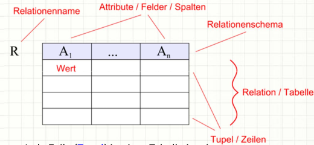

# Relationale Datenbanken

## Was bedeutet Relational
Eine Relationale Datenbank kann man sich als eine Sammlung von Tabellen vorstellen in welchen Datensätzen abgespeichert sind.

SQL Abfragen beziehen sich auf Relationales Algebra, was auch ein Grund dafür ist das es in diesem Bereich wenig inovationen gibt.

## Eine Relation

+ Jede Zeile (Tupel) in einer Tabelle ist ein
Datensatz (record).
+ Jedes Tupel besteht aus einer Reihe von
Attributwerten (Attribute = Eigenschaften),
den Spalten der Tabelle.
+ Das Relationenschema legt dabei die Anzahl
und den Typ der Attribute für eine Relation
fest. Das Bild illustriert die Relation R mit
Attributen A 1 bis A n in den Spalten.

## Beziehungen zwischen Tabellen
Weiterhin können Verknüpfungen genutzt werden, um die Beziehungen zwischen
Tabellen auszudrücken.

Anhand der Primär und Sekundärschlüssel ist es Möglich beziehungen zwischen Tabellen herzustellen.

## Entity Relationship Model (ER)
**Relationen**
Eine Relation besteht aus Attributen und Tupeln.
Ein Tupel stellt eine konkrete Kombination von Attributwerten dar und wird im Datenbankbereich auch als Datensatz bezeichnet.

1 zu 1 `1 --> 1`

1 zu viele `1 --> n, m`