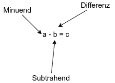

# Ganze Zahlen
ℤ = { ..., -2, -1, 0, 1, 2, ... }

## Rechenoperationen
- Addition

abc ∈ ℕ

Kommutativ Gesetz (Summanten können getauscht werden)

- Subtraktion

abc ∈ ℤ

Kein Kommutativ Gesetz
a-b ≠ b-a