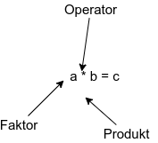

# Natürliche Zahlen

**Definition**:
ℕ = { 0, 1, 2, 3, ... }

**Rechenoperationen**:

- Addition

abc ∈ ℕ

Kommutativ Gesetz (Summanten können getauscht werden)

- Multiplikation

abc ∈ ℤ

Kommutativ Gesetz (Summanten können getauscht werden)