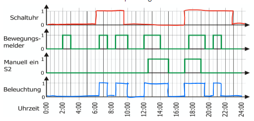
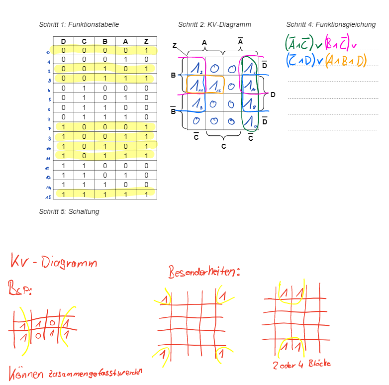
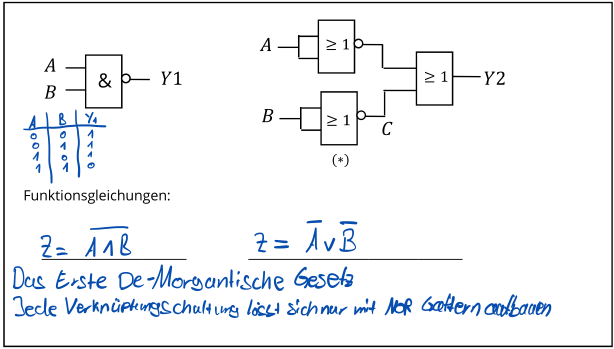
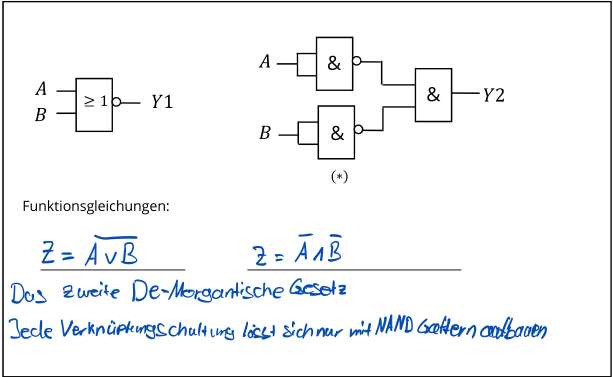
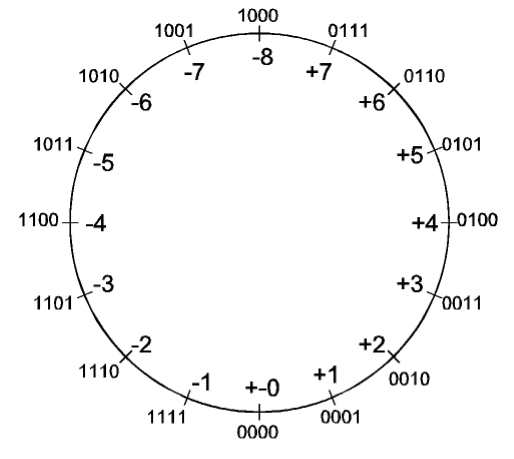
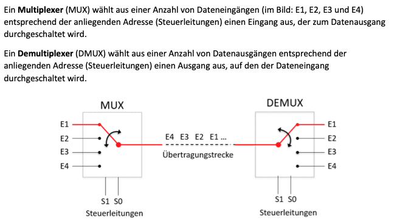
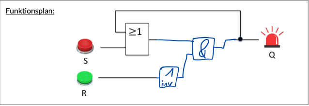
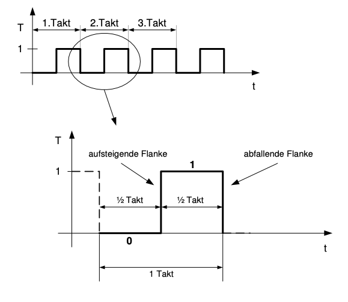
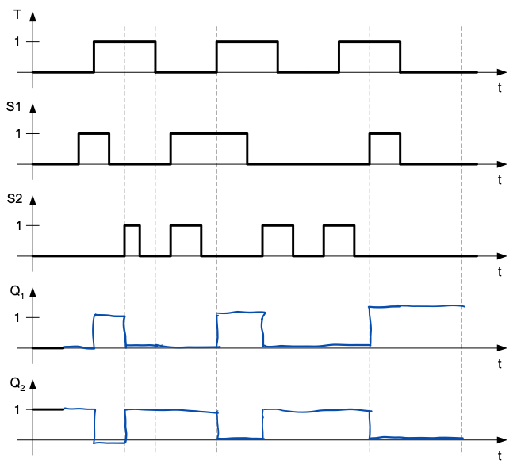
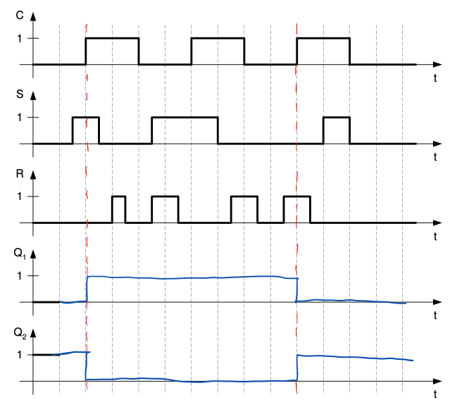

# MC KA1 Zusammenfassung

## Themen
+ **Zahlensysteme**
    + Dual
    + Hexadezimal
    + Dezimal
+ **Logische Verknüpfungen**
    + Und
    + Oder
    + Nicht
    + Nand
    + Xor
    + Nor
+ **Wahrheitstabellen**
+ **Disjunktive Normalform (DNF)**
+ **Impulsdiagramme**
+ **KV-Diagramme**
+ **DeMorganische Gesetz**
    + Umwandlung einer Nor oder Nand Schaltung
+ **2er Komplement**
+ **Multiplexer**
+ **Addition von Dualzahlen**
+ **RS-FlipFlop**

# Zahlensysteme

## Dual

**Basiszahl: 2**

**Ziffern: (0,1)**

Beispiel: 

`10010` = 18

**Umrechnen von Dualzahlen ins Dezimalsystem**

16, 8, 4, 2, 1

16+2=18

-> 1\*2^4 + 0\*2^3 + 0\*2^2 + 1\*2^1 + 0\*2^0 (10010)

== 18

**Umrechnen von Dezimalzahlen in Dualzahlen**

Bsp. 18

18/2 = 9 Rest 0 -> 0

9/2  = 4 Rest 1 -> 1

4/2  = 2 Rest 0 -> 0

2/2  = 1 Rest 0 -> 0

1/2  = 0 Rest 1 -> 1

== 10010

## Hexadezimal

**Basis: 16**
**Ziffern: (0, 1, 2, 3, 4, 5, 6, 7, 8, 9, A, B, C, D, E, F)**

-> 119 -> 1\*16^2 + 1\*16^1 + 9\*16^0

**Umwandlung von Dual in Hexadezimal**

{ 1001 0001 1101 } -> ToDo!

# Logische Verknüpfungen

## And

**Funktionsgleichung** 

Q = A^B

**Wahrheitstabelle**
A|B|Q|
--|--|--|
|0 |0 |0
|0|1| 0
|1|0|0
|1|1|1

## Or

**Funktionsgleichung** 

**Wahrheitstabelle**
A|B|Q|
--|--|--|
|0 |0 |0
|0|1| 1
|1|0|1
|1|1|1

## Not

**Funktionsgleichung** 

**Wahrheitstabelle**
A|Q|
--|--|--|
|0 |1
|1|0

## Nand

**Funktionsgleichung** 

**Wahrheitstabelle**
A|B|Q|
--|--|--|
|0 |0 |1
|0|1| 1
|1|0|1
|1|1|0

## Nor 

**Funktionsgleichung** 

**Wahrheitstabelle**
A|B|Q|
--|--|--|
|0 |0 |1
|0|1| 0
|1|0|0
|1|1|0

## Xor

**Funktionsgleichung** 

**Wahrheitstabelle**
A|B|Q|
--|--|--|
|0 |0 |0
|0|1| 1
|1|0|1
|1|1|0

## Wahrheitstabellen

**Bsp mit 1 Variablen**
A|Q|
--|--|
|0 |x
|1|x

**Bsp mit 2 Variablen**
A|B|Q|
--|--|--|
|0 |0 |0
|0|1| 1
|1|0|1
|1|1|0

**Bsp mit 3 Variablen**

A|B|C|Q|
--|--|--|--|
|0 |0|0 |x
|0|0|1| x
|0|1|0|x
|0|1|1|x
|1|0|0|x
|1|0|1|x
|1|1|0|x
|1|1|1|x

## Disjunktive Normalform

+ **Vollkonjunktion:** Ist die UND-Verknüpftung in der alle vorhandenen Eingangssignale einmal vorkommen (negiert oder nicht)
+ **Disjunktive Normalform:** Besteht aus mehreren oder Verknüpften Vollkonjunktionen

Bsp. 

## Impulsdiagramm

## KV-Diagramm

## DeMorgan Gesetze

### Regel 1

### Regel 2

## 2er Komplement

### Negative Zahlen im Dualsystem darstellen

> **Das Bit mit der größten Wertigkeit wird Negativ gewertet. Die restlichen Bits werden auf Addiert.**

Bsp1.
|-8|4|2|1|
-|-|-|-|
|1|1|1|1

= -1

Bsp2.
|-16|8|4|2|1|
-|-|-|-|--|
|1|1|1|1|1

= -1

### Schritt 1: Alle Stellen Invertieren

Aus `0010` wird `1101`

### Schritt 2: Mit 1 Addieren

`1101` + `0001` = `1110`

### Rechnung

`0101` (5) + `1110` (-2) = `0011` (3) 

> **Im Zahlenbereich bei 4-Bit. Von [-8] bis [7] kein Übertrag bei der Addition.**

## Multiplexer

## RS-Flip Flop

### Funktionsplan eines RS-Flip Flops ohne Taktsteuerung

### Taktsteuerung

### Taktzustand Gesteuert

### Taktflanken Gesteuert
