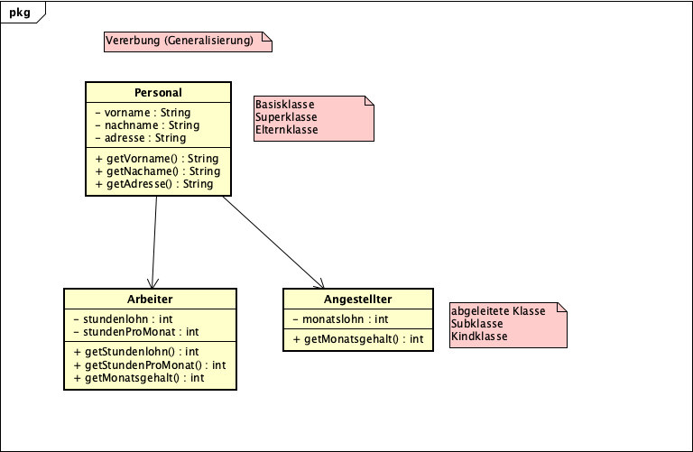

# Vererbungen in Java

## Basisklasse

```java
public class Base{
    private String name;
    private String adresse;
}
```

## Abgeleitete Klasse

```java
public class Child extends Base{
    private int gehalt;
}
```
## Übungsaufgabe
