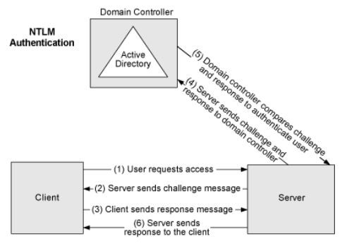
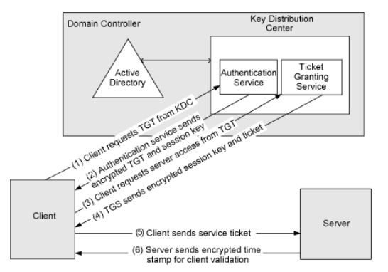

# Active Directory Security
In diesem Dokument geht es speziell um die Authentifizierungverfahren und deren Schwachstellen
im Bereich NTLM und Kerberos.

## NTLM
Windows New Technology LAN Manager oder kurz NTLM ist ein Authentifizierungsprotokoll um Benutzer und Ressourcen
Netzwerkübergreifend zu Authentifiziern.

Ein Typischen NTLM Authehtification FLow sieht wie folgt aus:

NTLM wurde bis Windows 2000 als Standard Authetifizierungsprotokoll genutzt.
Sicherheitslücken die in NTLM bestehen:
+ Die in NTLMv1 verwendeten Hash Alogrythmen sind aus heutiger Sichet veraltet und können in wenigen Sekunden geknackt werden. Da auch kein Salting stattfindet.
+ Der Hash bei NTLMv2 wird zwar vor dem Senden gesalted, liegt aber unbearbeitet im RAM den PCs.
+ Da bei NTLM das Passwort im Hash enthalten ist besteht hier immer die Gefahr, dass das Passwort (auch zu einem spätern Zeitpunkt) kompromitiert werden kann.

## Kerberos
Ab Windows 2000 und aufwärts wurde NTLM duch Kerberos abgelöst.

Kerberos behebt einige in NTLM vorhandene Sicherheitslücken.

Ein Typischen Kerberos Authehtification FLow sieht wie folgt aus:

Vorteile von Kerberos im vergelich zu NTLM:
+ Kerberos sendet keine Passwort Hashes übers Netzwerk
+ Performanter als NTLM
+ Support für Multi Factor Authentication