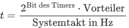

# AVR - Timer

Ein Timer ist ein Register im Microcontroller das Hardwaregesteuert nach jedem Takt um 1 erhöht oder umd 1 verringert wird.

## Prescaler
Der Prescaler sorgt dafür, den Systemtakt um den angegebenen Faktor zu teilen. Damit der Timer nicht an den Systemtakt gebunden ist und somit die Laufzeit des Timers systematisch zu erhöhen.

Bei einem 8 Bit Timer kann der Prescaler auf die Werte 1, 8, 64, 256 oder 1024 eingestellt werden.
Steht der Vorteiler also auf 1024, so wird nur bei jedem 1024-ten Impuls vom Systemtakt das Timerregister um 1 erhöht.

Um zu Berechnen wie lange es dauert bis der Timer durchläuft, muss der Systemtakt durch den Prescaler geteilt werden.

```console
( MHz / Prescaler ) / 256 = Zyklen bis zum Overflow
```



Bsp:

Vorteiler|Overflows/Sekunde |  Zeit zwischen 2 Overflows [s]
|--|--|--|
1 | 15625  |     0.000064  =  64 µs
8 |1953.125 |    0.000512  = 512 µs
64  |244.1406 |   0.004096  ≈   4,1 ms
256  |61.0351 |  0.016384  ≈  16,4 ms
1024 |15.2587|  0.065536  ≈  65,5 ms

## Zeitspanne Berechene
Um die Zeitspanne zwischen den Timeraktivierungen zu Berechene.
Müssen wie schon zuvor die Zyklen bis zum Timer Overflow Berechnet werden.

```console
( MHz / Prescaler ) / 256 = Zyklen bis zum Overflow
```

Im Anschluss muss diese Wert durch die anzahl der Möglichen Zustände geteilt werden ein und aus also 2
Bedeutet:

```console
Zyklen bis zum Overvlow / 2 = Zeitspanne in MHz
```

## Timer Konfiguration
Um den Timer zu Konfigurieren steht das 8-Bit Timer0 Register `TCCR0` zur Verfügung.
Dieses wird mit den Prescalern `CS02	CS01	CS00` bestückt.

```c
TCCR0 |= ( 0 << CS02 ) | ( 0 << CS01 ) | ( 1 << CS00 );
```

Prescaler Tabelle:
CS02	|CS01	|CS00|	Bedeutung
|--|--|--|--|
0|	0|	0|	keine (Der Timer ist angehalten)
0|	0|	1|	Vorteiler: 1
0|	1|	0|	Vorteiler: 8
0|	1|	1|	Vorteiler: 64
1|	0|	0|	Vorteiler: 256
1|	0|	1|	Vorteiler: 1024
1|	1|	0|	Vorteiler: Externer Takt vom Pin T0, fallende Flanke
1|	1|	1|	Vorteiler: Externer Takt vom Pin T0, steigende Flanke

Im oben gezeigen `C` Beispiel wird der Prescaler auf `1` gesetzt.

## Timer Preload Berechnen

In manchen Fällen verzögert der Prescaler den Timer zu lange um auf das genünschte Ergebnis zu kommen.
Dem kann mit einem Timer Preload entgegengekommen werden.
Dazu muss der Preload im Register `TCNT0` gespeichert werden.

Berechnet wird der Preload mit folgender Formel:
> Für einen 8-Bit Timer
```console
Startwert = 256 - (Takt * Verzögerungszeit / Prescaller)
```

Beispiel für 8-Bit Timer mit Prescaler von 265 und 250ms Verzögerung:
```console
preload = 265 - (16000000 * 250 / 256) = 15625
```