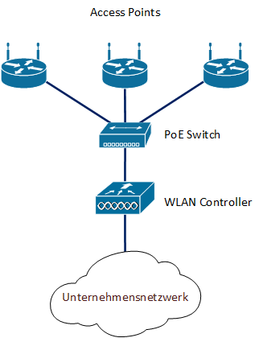

# WLAN Controller Setup

Bei einem WLAN Controller basierten Setup. Werden alle APs an den
Controller angebunden, dieser übernimmt dann die Koniguration der einzelnen APs. Somit herscht auf der gesammten Umgebung eine einheitliche Konfiguration.

1. Netzwerk Setup
1. AP Provisioning
1. AP Konfiguration
1. Management

## Netzwerk Setup
Für ein Controller basiertes Setup wird ein eigenes Management Netzwerk für die Kommunikation der APs mit dem Controller empfohlen.
Da in diesem Netz ein DHCP Server eingerichtet werden muss, der die APs mit IP Adressen versorgt um die interne Kommunikation mit dem Controller herzustellen.

## AP Provisioning
Vorteil eines solchen Setups ist, dass die APs automatisch durch den Controller verwaltet und konfiguriert werden. Daher kann dieses Setup ganz einfach Erweitert werden.

## AP Konfiguration
Die meisten APs unterstützen die beiden Verbindungsverfahren.
Tunneled und Bridged. Bei einer Tunneled Verbindung werden die Daten die über den AP geleitet werden an den Controller geschickt, dieser Leitet die Daten von dort aus ins Netz.
Bei einem Bridged Setup, werden die Daten von AP direkt über einen zusätzlichen Ethernet Port direkt ins Netwerk übergeben ohne den bremsenden zwischenschritt über den Controller.

## Management
Der WLAN Controller bildet ist der einzigste Punkt an dem Konfigurationen angepasst werden müssen. Änderungen werden dann automatisch an alle Verwalteten APs verteilt und angewandt.
